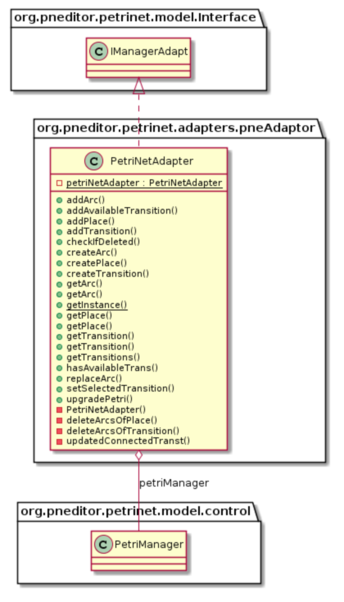
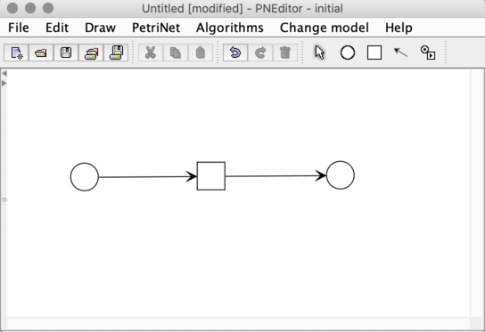

PNEditor (Petri Net editor)
========

##README

This project has two essential components, in one hand is the pne-editor (based-on project) and in the other hand 
is the petriNet model. Given that both projects were built in isolated mode, the logic behind operations may differ 
from one to the other. An adapter pattern was implemented to articulate the processing of the net in both models.

    

## Possible improvements

### The complexity of recognizing an arc

***Problem***

In the previous model an arc was modeled by its weight, connectedPlace, id and if it was in "in direction" or out from the
place. Given that, we only had information related to the place that was connected. The relation source - destination was
modeled for transitions.

In the PNEditor, the class *GraphicArc* doesn't have id. That leads to an unpleasant situation
because everytime we need to find the corresponding arc of a GraphicArc in our model, we had to, first 
 find the connected place asking whether it was source or destination and then iterate over
every transition to find the transition which is connected this arc, then look for the id and realize
it was a inArc or OutArc. And to know whether an arc in the model is the graphic arc or not, we have to compare their connected place,
and then we can finally get the arc object from its arc lists.

***Solution***

Improve the model in the step of conception, and save the connected arc information in places.
Cause we can easily get the connected place id from the GraphicArc and places in model have same id with
GraphicPlace, we can easily obtain the model place id. If we have the connected arc information
in the model place, we are able to get the corresponding model arc in one line instead of 
two layers by iteration. 

### The code duplication in PetriNetAdapter

***Problem***

In the adapter class, the function *checkIfDeleted* has a part of logic that compares the model
PetriNet with the *GraphicPetriNet* at the moment of firing a transition. It will check whether
every element in the model has the corresponding graphic element in the *GraphicPetrinet*
.

The project must have been more modular in terms of comparing the two nets in different methods. 
Methods *compareArcs*, *compareTransitions* and *comparePlaces* compares elements in 
the two PetriNet too, their purpose is to find the elements that are only in one mother but not 
in the other one and has more reach than *checkIfDeleted*, because it also checks whether there's something added
in the GraphicPetrtNet and not in the PetriNet model.

***Solution***

Extract the network comparing part from the function *checkIfDeleted*, and combine it with
the function *comparePetri*.

### The complexity added using a more dynamic context: the editor

***Problem***

The requirements were set from the beginning, the user could modify the net in any way, but the logic
behind that change of the net was easier without the editor because the user would modify the elements
in the final net that was being created. With the editor the user can create elements and delete
them, the problem goes when the user has the ability to copy or even cut an element. Let's suppose that the
user has created a net like the following one:

Now, the user wants to change a bit and decides to cut one transition and the paste it anywhere.
Now we have this: 

We have lost an arc. And if we suppose that the used process was copy/paste then after pasting
we would have a place with a different id (not created with the add place button) and therefore
the connectedPlace of that transition will be null. Those tools give a lot of dynamism
to the process of modifying the net. 

The process of creating elements was done using the buttons of the editor so at the end trying to find the different
elements to add them increases the complexity behind the net. Also, in the case that more than one place have been
pasted then we will have two arcs in null connectedPlace parameters and then, finding which arc has to connect
to which place won't be possible.

***Solution***

Once again the problem is located in the stage of conception and doing a exploratory inspect of the problem and
the requirements. When articulating work with the editor was required a exhaustive search of nre challenges must have been done.

The creation of the elements could have been done in the fire stage. In that way only by comparing
the two nets and adding to petriNet the missing elements would have been enough. It also would have been
a cleaner option given that the models would have been more isolated.

## What we did well

### Applied the singleton design pattern

Although it's a very simple design pattern, we used it to design our model manager class *PetriNetManager*
 and the the adapter *PetriNetAdapter*. It ensure that all objects access the single adapter or manager which 
 guarantees the net information owned by each object is kept in sync.
 
### The separation of model and control level

We have split the control class *PetriManager* from the entities. Entity classes
is not responsible for the logic and changing the their own state. It's also a kind
of Facade Pattern.

Code license: [GNU GPL v3](http://www.gnu.org/licenses/gpl.html)

Requirements: Java SE 6+

